  * Scenarios 
      * [Deploy Pool](#deploy-pool)
      * [Init Pool](#init-pool) 
      * [Mint](#mint)
      * [Swap](#swap) 
      * [Burn](#burn) 

# Scenarios

## Deploy Pool

## Init Pool

## Mint

## Swap

## Burn

      