# 📜 Scenarios

* Scenarios
  * [Deploy/Init Pool](scenarios.md#deploy-init-pool)
  * [Mint](scenarios.md#mint)
  * [Swap](scenarios.md#swap)
  * [Burn](scenarios.md#burn)

## Scenarios

### Deploy/Init Pool

Pool deployment is triggered by the administrator of the AMM (this person is also the administrator of the router contract - `router::admin_address`) by invoking the operation [CREATE\_POOL](router.md#routerv3\_create\_pool). Pool deployment leads to the processing of the [POOLV3\_INIT](pool.md#poolv3\_init) operation inside the pool contract. This operation is used both - during the initial pool deployment and when the pool administrator wants to change some crucial parameters. Pool deployment consists of two stages

I. Forming and sending state\_init data that holds

* Router address
* Jetton0/Jetton1 wallet addresses (these are attached to the router)
* [Account](account.md) contract code
* [Position NFT](position\_nft.md) contract code

Next newly created pool would only accept the init message from the router and admin(which is set to BLACK\_HOLE\_ADDRESS in state\_init). No operations (except for [POOLV3\_INIT](pool.md#poolv3\_init)) would be processed while the administrator address is equal to BLACK\_HOLE\_ADDRESS.

This ensures that the only thing that could activate the pool is the init operation sent by the pool

II. state\_init message holds as a body [POOLV3\_INIT](pool.md#poolv3\_init) operation

This message will be accepted and sets all the data that is needed for pool operation, including an optional flag that would activate the pool and make it available for mints and swaps

<figure><figcaption></figcaption></figure>

### Mint

Position minting is done by sending two jettons to the router. Generally user calls [pool::getMintEstimate](pool.md#getmintestimate) to estimate the amount of the jettons that the person needs to send to mint a particular amount of liquidity in the given price range (tick range). Optionally user may send more jettons than needed to account for possible slippage.

While sending both jettons to router wallets, the user sends the payload that contains the position parameters. On receiving the jettons (operation [JETTON\_TRANSFER\_NOTIFICATION](router.md#routerv3\_transfer\_notification) ) router would compute the pool address and forward the operation to the pool ([POOLV3\_FUND\_ACCOUNT](pool.md#poolv3\_fund\_account))

<figure><figcaption></figcaption></figure>

### Swap

Generally user calls [pool::getSwapEstimate](pool.md#getswapestimate) to estimate the amount of the jettons that he/she needs to send to swap&#x20;

<figure><figcaption></figcaption></figure>

### Burn and Burn0/Collect

<figure><figcaption></figcaption></figure>
